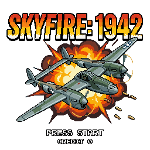

# Skyfire Patrol

A 1942-style WWII vertical scrolling shooter built in C++ with SDL3.



---

## Gameplay

You pilot a Lockheed P-38 Lightning through 32 stages across 8 Pacific campaigns, fighting your way from Midway to Tokyo. Shoot down enemy formations, dodge bullet patterns, collect power-ups, and destroy bosses at the end of each campaign.

### Controls

| Key | Action |
|---|---|
| Arrow keys | Move |
| Space / Z | Fire (hold to auto-fire) |
| X / Shift | Barrel roll (Loop) |
| P / Escape | Pause |
| Enter | Confirm / Start |
| T | Toggle training mode / Level select (from menu) |

### Barrel Roll (Loop)

Press X or Shift to perform a barrel roll. While rolling, your plane is invincible — use it to dodge bullet walls. You have a limited number of loops per stage (shown in the HUD). Extra loops are awarded by power-ups and stage-clear bonuses.

---

## Campaigns & Stages

The game counts down from stage **32** to stage **1**. Each campaign spans 4 stages; the last stage of each campaign is a boss battle.

### Campaign 1 — Midway (Stages 32–29)
**Background:** Deep Pacific ocean, coral reef formations beneath the surface.  
**Enemies:** Black, red, and blue Zero fighters in straight and sine-wave formations. Betty bombers debut at stage 30.  
**Boss:** Ayako (bossIndex 1) — fighter-type boss with 5-bullet fan spread.

### Campaign 2 — Marshall Islands (Stages 28–25)
**Background:** Turquoise tropical lagoon, white sandy atolls.  
**Enemies:** Same Zero variants with heavier LOOP_DIVE and ARC patterns. UFO mystery target appears for the first time.  
**Boss:** Ayako II (bossIndex 2) — faster fire rate than the first boss.

### Campaign 3 — Attu / Aleutians (Stages 24–21)
**Background:** Cold gray northern Pacific, rocky Aleutian shores, sea foam.  
**Enemies:** Green Zero introduced (4th fighter color). More Betty bombers, denser formations.  
**Boss:** Heavy Cruiser (bossIndex 3) — warship boss; sweeps aggressively side-to-side.

### Campaign 4 — Rabaul (Stages 20–17)
**Background:** Dark volcanic ocean with ash. Volcanic islands and dense jungle coastlines.  
**Stage 20 — Double Flankers:** Green Zeroes sweep from both screen edges simultaneously in mirrored ARC pairs, crossing mid-screen in a pincer.  
**Stage 19 — Bonus Stage:** No enemy fire. Dense formations of fighters fill the sky — maximum shooting opportunity, no threat.  
**Stage 18 — Double-Decker Bombers:** A 6-plane wide bomber wall drops onto the screen, double the normal formation width.  
**Enemies:** D3A Val dive-bombers debut as a MEDIUM-class enemy with a dive-bomb attack pattern. Helen bombers replace Betty.  
**Boss:** Heavy Cruiser II (bossIndex 4) — enraged fire rate at half HP.

### Campaign 5 — Leyte Gulf (Stages 16–13)
**Background:** Oil-slicked battle water, burning debris. Tropical palm and jungle islands.  
**Stage 16 — High-Speed Scouts:** Fast black fighters cross the screen at 2.4× normal speed in SINE waves. They do not fire — pure evasion challenge.  
**Stage 15 — Bonus Stage:** No enemy fire. ARC formations sweep from both sides in dense waves for point farming.  
**Stage 14 — Zig-Zag Fighters:** Fighters abandon standard patterns and pivot 90° left/right as they descend — sharp, unpredictable movement.  
**Enemies:** Ki-49 Helen heavy bombers continue. Val dive squads continue through this campaign. Kamikaze LOOP_DIVE debut.  
**Boss:** Carrier Kaga (bossIndex 5) — large carrier boss with rapid 5-bullet spread.

### Campaign 6 — Saipan (Stages 12–9)
**Background:** Industrial military harbor, concrete docks. Tropical and atoll islands.  
**Stage 12 — Sniper Zeroes:** Fighters begin aiming their shots at your current position instead of firing straight down. Every bullet tracks you.  
**Stage 11 — Bonus Stage:** No enemy fire. Heavy ARC and SINE formations — the last safe breathing room before the endgame.  
**Stage 10:** Sniper aiming continues. Kamikaze pressure increases to 2 squads. Maximum mid-game challenge.  
**Enemies:** Kamikaze squads scale from 1 (stage 12) to 3 (stage 9). All bullets are aimed from here onward.  
**Boss:** Carrier Kaga II (bossIndex 6) — frantic fire rate at quarter HP.

### Campaign 7 — Iwo Jima (Stages 8–5)
**Background:** Dark gray volcanic sand beach, black lava fields, ash and pumice. Volcanic islands only.  
**Stage 8:** Complete chaos — sniper Zeroes, kamikaze dive-bombers, Helen bombers, and Val squads all active simultaneously. Nate fighters debut.  
**Stage 7 — Final Bonus Stage:** No enemy fire. The last bonus wave in the game — maximum density, 18 formations.  
**Stage 6 — Red Chain:** A rapid chain of 5 consecutive red formation squads (15 sniper Zeroes total) fires back-to-back with minimal gaps. Destroys all 15 for a Yashichi bonus.  
**Enemies:** Ki-27 Nate (5th fighter color, dark grey) introduced. 3 kamikaze squads per wave. Enemy bullets faster than normal.  
**Boss:** Battleship Yamato (bossIndex 7) — massive warship boss, high HP, aggressive sweep pattern.

### Campaign 8 — Okinawa / Tokyo (Stages 4–1)
**Background:** Dense Tokyo city grid from above — roads, rooftops, and parks. No small islands; wall-to-wall carrier ships.  
**Enemies:** Ki-43 Oscar introduced (6th fighter color, tan camo) — Okinawa-exclusive. All enemy types in play simultaneously. Maximum speed and formation density. Enemy bullets 40% faster than base speed. All fighters fire aimed sniper shots.  
**Boss:** Battleship Yamato Final (bossIndex 8) — highest HP in the game, fastest fire rate, enrages at quarter HP.

---

## Enemy Types

| Type | HP | Description |
|---|---|---|
| **SMALL** | 1 | Fighter aircraft. Rotates through 3–6 color variants depending on campaign. |
| **MEDIUM** | 3 | Kamikaze (dark blue LOOP_DIVE) and Val dive-bombers (olive DIVE pattern). |
| **LARGE** | 8 | Betty / Helen bombers flying straight down in 3-plane formations. |
| **UFO** | 1 | Mystery bonus target, SINE pattern, appears from Marshall onward. High score value. |

### Fighter Aircraft (color progression)

| Color | Sprite | Unlocks |
|---|---|---|
| Black | A6M Zero | Stage 32 (all campaigns) |
| Red | A6M Zero | Stage 32 (all campaigns) |
| Blue | A6M Zero | Stage 32 (all campaigns) |
| Olive Green | A6M Zero | Stage 24 (Attu onward) |
| Dark Grey | Ki-27 Nate | Stage 8 (Iwo Jima onward) |
| Tan Camo | Ki-43 Oscar | Stage 4 (Okinawa only) |

---

## Enemy Patterns

| Pattern | Description |
|---|---|
| **STRAIGHT** | Flies directly downward in formation. |
| **SINE** | Weaves left and right as it descends. |
| **DIVE** | Enters formation, pauses, loops, then dives at the player. |
| **ARC** | Sweeps in from one edge, arcs across the screen, exits opposite side. |
| **LOOP_DIVE** | Enters from above, performs a full 360° loop, then dives directly at the player. |
| **ZIGZAG** | Alternates between descending and sharp 90° horizontal pivots — unpredictable. Leyte only. |

### Special Enemy Behaviors

| Behavior | Description |
|---|---|
| **Sniper** | Enemy bullets are aimed at your current position, not fired straight down. Active from Saipan onward. |
| **No-Fire** | Enemy never fires. Used in bonus stages — maximum enemies, zero threat. |
| **Double Flanker** | Two simultaneous ARC formations from both screen edges — Rabaul stage 20. |
| **High-Speed Scout** | 2.4× speed SINE fighters that cross without firing — Leyte stage 16. |
| **Red Chain** | 5 rapid red sniper formations spawned in 3-second succession — Iwo Jima stage 6. |

---

## Bosses

Bosses spawn at the end of every 4th stage. They move side-to-side in a sinusoidal sweep and fire aimed + spread bullet patterns. Fire rate increases at 50% and 25% HP.

| Boss Index | Stages | Sprite | HP |
|---|---|---|---|
| 1 | Stage 29 | Ayako (fighter) | 80 |
| 2 | Stage 25 | Ayako II | 110 |
| 3 | Stage 21 | Heavy Cruiser | 140 |
| 4 | Stage 17 | Heavy Cruiser II | 170 |
| 5 | Stage 13 | Carrier Kaga | 200 |
| 6 | Stage 9 | Carrier Kaga II | 230 |
| 7 | Stage 5 | Battleship Yamato | 260 |
| 8 | Stage 1 | Battleship Yamato Final | 290 |

---

## Power-Ups

Power-ups drop from red squadron formations (every other formation is a red squadron).

| Power-Up | Effect |
|---|---|
| **Double Shot** | Upgrades fire level (up to 4 simultaneous bullets). |
| **Wingman** | Adds a wingman aircraft that fires alongside you. |
| **Extra Loop** | Grants an additional barrel roll charge. |
| **Freeze Bullets** | Enemy bullets freeze on screen for several seconds. |
| **Extra Life** | Adds one life. Drops from bomber formations. |
| **Score Red** | Bonus points. Drops from UFOs. |
| **Yashichi** | Rare spinning token — massive point bonus. |
| **Screen Wipe** | Destroys all enemies currently on screen. |

---

## Stage Tally

After each stage clears, a tally screen shows:
- **Shooting %** — percentage of enemies destroyed.
- **Loop Bonus** — 1,000 pts per unused loop charge.
- **Perfect Bonus** — 50,000 pts for 100% shooting accuracy.

---

## Scoring

| Event | Points |
|---|---|
| Small fighter | 100 |
| Medium enemy | 300 |
| UFO | 1,000 |
| Carrier ship (terrain) | 5,000 |
| Boss kill | 50,000 |
| Loop bonus (per charge) | 1,000 |
| Perfect stage bonus | 50,000 |

---

## Building

**Requirements:** Windows, MSVC, SDL3, SDL3_image, SDL3_mixer, SDL3_ttf.

```
msbuild Shooter.vcxproj /p:Configuration=Debug /p:Platform=x64
```

Output: `x64/Debug/Shooter.exe`

The game uses a 360×640 logical canvas with `SDL_LOGICAL_PRESENTATION_LETTERBOX` — it scales to any window size while maintaining aspect ratio.

---

## Asset Credits

- Pixel art sprites generated with [PixelLab](https://pixellab.ai)
- Campaign background tilesets generated with PixelLab
- Music: original compositions
